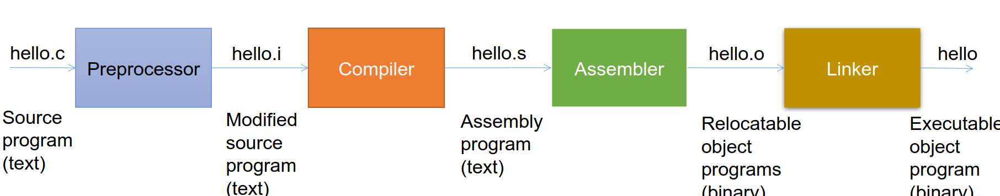

Topic 1: A Tour of Computer Systems
========================

## Computer Systems
+ **Definition** - consists of hardware and systems software that work together to run application programs
+ Systems programming is the study of the operation of such systems and gaining the ability to program such systems
    + Such knowlege will make you a better programmer
+ "Hello world" as an example of how important it is to understand computer systems
```C
#include <stdio.h>
int main() {
    printf("hello, world);
    return 0;
}
```

### Representation of Hello World
+ Facts:
    + The hello world source code is represented in memory (and stored on disk) as a sequence of bytes.
    + Each byte is just a number
    + Each byte represents one character
    + Each character is encoded according to the ASCII table
        + The '#' is actually the number 35
        + the 'i' in 'include' is actually the number 105
    + Each lie is terminated by a special, invisible character called the **newline** character
        + Which is the number 10
        + Except for Windows; the end of line is two characters: a carriage return followed by a newline
    + Files that hold such data (text encode as ASCII characters) are termed a **text file**
    + All other files are considered **binary files**

### Data Representation
+ Everything in a computer is stored as a sequence of bits
+ The only thing that distinguishes different data objects is the context in which we view them
    + Text editors display the bits as a sequence of characters
+ Another example: The String "150", the integer 150, and the float 150 are each stored differently
+ If we do not understand this, we may get unexpected results in our programs

### Programs are Translated by Other Programs into Different Forms
+ The text file that contains the "Hello, World" program cannot be executed by a computer
+ Its human readable representation is only understood by humans
+ It has to be translated into **machine language** file called an **executable file**

### Compilation



### It Pays To Understand How Compilation Works
+ Understanding compilation helps us
    + Optimize program performance
    + Understanding link-time errors
    + Avoiding security holes
    + Write mixed language programs
    + Understand how scoping works
    + and lots more...

### Processors Read and Interpret Instructions Stored in Memory
+ Once a source code file is translated into an executable you can run it from a shell or an icon
+ The shell is a command line interpreter that prints a prompt, waits for you to type a command line, and then performs the command
+ If the first word of the command line does not correspond to a built in shell command, then the shell assumes that it is the name of an executable file that it should load and run

### Hardware Organization of a System


### Main Memory
+ The main memory is a temporary storage device that holds both a program and the data it manipulates while the processor is executing the program
    + Main memory holds both data and code
+ Physically, main memory consists of a collection of *dynamic random access memory* (or DRAM) chips
+ Logically, memory is organized as a linear array of bytes, each with its own unique address (array index) starting at zero
+ Each of the machine instructions that constitute a program can consist of a variable number of bytes
+ The sizes of data items that correspond to C program variables vary according to type
    + On a X86-64, a short is two bytes, an int is 4 bytes, a long is 8 bytes, a long long is 8 bytes, a float is 4 bytes, and a double is 8 bytes
    + Windows is an exception (of course). A long on Windows is 4 bytes long.

### Processor
+ The **central processing unit (CPU)**, or simply processor, is the engine that interprets (or executes) instructions stored in main memory
+ It has a word-size register called the **program counter (PC)**
+ The PC points at (contains the address of) some machine-language instruction in main memory
+ The processor repeatedly executes the instruction pointed at by the program counter
    + From the time that power is applied to the system until the time the power is shut off
+ After executing an instruction, the processor updates the program counter to point to the next instruction
+ A processor operates according to a very simple instruction execution model, defined by its instruction set architecture
+ Instructions execute in strict sequence
+ However, each instruction execution requires a number of steps, called the **fetch-and-execute** cycle:
    + The processor reads the instruction from memory pointed at by the PC
    + It then interprets the bits in the instruction, and performs some simple operation dictated by the instruction
    + It then updates the PC to point to the next instruction
+ These simple instructions typically manipulate main memory, registers, or I/O ports
    + Registers are word-sized, very fast memory located on the CPU chip
    + I/O ports are special device memory addresses used to manipulate off-chip I/O devices (such as the SSD, USB device, ect.)

#### Processor Instructions
+ The arithmetic/logic unit (ALU), which is part of the processor, computes new data and address values
+ Some examples of the simple operations that the CPU might carry out are:
    + Load: copy a byte or a word from main memory into a register, overwriting the previous contents of the register
    + Store: Copy a byte or a word from a register to a location in main memory, overwriting the previous contents of that location
    + Add, Subtract, Divide, Multiply, and other operations: Copy the contents of two registers to the ALU, perform an arithmetic operation on the two words, and store the result in a register, overwriting the previous contents of that register
    + Jump: Extract a word from the instruction itself and copy that word into the program counter (PC), overwriting the previous value of the PC.
+ A CPU has an **instruction set**
+ Various models of CPUs that implement the same instruction set may have different implementations of that instruction set (with different optimizations)
    + They have different **microarchitectures**