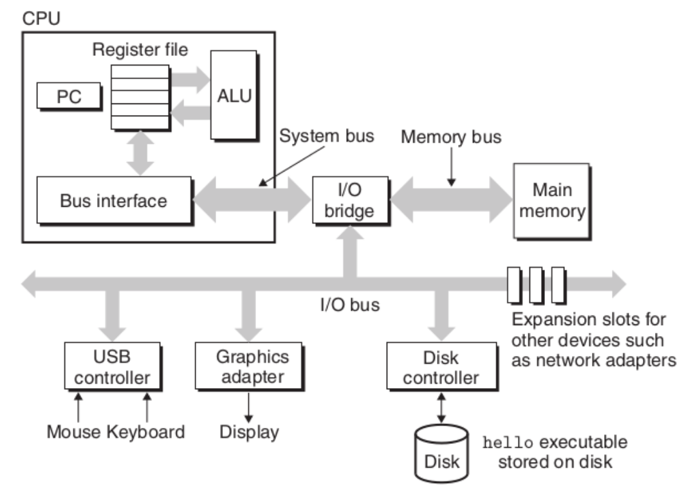

Topic 1: A Tour of Computer Systems
========================

## Computer Systems
+ **Definition** - consists of hardware and systems software that work together to run application programs
+ Systems programming is the study of the operation of such systems and gaining the ability to program such systems
    + Such knowlege will make you a better programmer
+ "Hello world" as an example of how important it is to understand computer systems
```C
#include <stdio.h>
int main() {
    printf("hello, world);
    return 0;
}
```

### Representation of Hello World
+ Facts:
    + The hello world source code is represented in memory (and stored on disk) as a sequence of bytes.
    + Each byte is just a number
    + Each byte represents one character
    + Each character is encoded according to the ASCII table
        + The '#' is actually the number 35
        + the 'i' in 'include' is actually the number 105
    + Each lie is terminated by a special, invisible character called the *newline* character
        + Which is the number 10
        + Except for Windows; the eol is two characters: a arriage return followed by a newline
    + Files that hold such data (text encode as ASCII characters) are termed a *text file*
    + All other files are considered *binary files*

### Data Representations
+ Everything in a computer is stored as a sequence of bits
+ The only thing that distinguishes different data objects is the context in which we view them
    + Text editors display the bits as a sequence of characters
+ Another example: The String "150", the integer 150, and the float 150 are each stored differently
+ If we do not understand this, we may get unexpected results in our programs

### Programs are Translated by Other Programs into Different Forms
+ The text file that contains the "Hello, World" program cannot be executed by a computer
+ Its human readable representation is only understood by humans
+ It has to be translated into *machine language* file called an *executable file*

### Compilation
+ Preprocessor
    + hello.c
        + Source program (text)
+ Compiler
    + hello.i
        + Modified source program (text)
+ Assembler
    + hello.s
        + Assembly program (text)
+ Linker
    + hello.o
        + Relocatable object programs (binary)
+ hello
    + Executable object program (binary)

### It Pays To Understand How Compilation Works
+ Understanding compilation helps us:
    + Optimize program performance
    + Understanding link-time errors
    + Avoiding security holes
    + Write mixed language programs
    + Understand how scoping works
    + and lots more...

### Processors Read and Interpret Instructions Stored in Memory
+ Once a source code file is translated into an executable you can run it from a shell or an icon
+ The shell is a command line interpreter that prints a prompt, waits for you to type a command line, and then performs the command
+ If the first word of the command line does not correspond to a built in shell command, then the shell assumes that it is the name of an executable file that it should load and run

### Hardware Organization of a System

